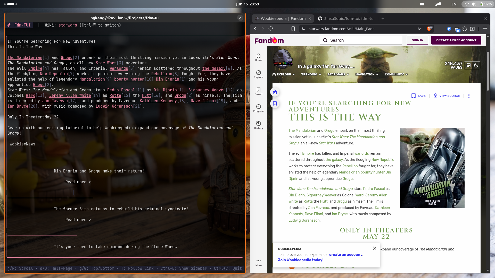

```text
    ______ ____  __  ___      ______ _  __ ____
   / ____// __ \/  |/  /     /_  __// / / //  _/
  / /_   / / / / /|_/ /       / /  / /_/ / / /  
 / __/  / /_/ / /  / /       / /  / __  /_/ /   
/_/    /_____/_/  /_/       /_/  /_/ /_//___/   
```

# ⚡ fdm-tui (Fandom Terminal User Interface)

A fullscreen, split-pane terminal reader for Fandom.com wikis, built in Go using the **Bubble Tea** and **Lip Gloss** frameworks.


---

## 📸 Demo Preview (Wookieepedia)



---

## 🕵️ Motivation (Stealth Mode)

Designed specifically to bypass your boss's line of sight. Looking at gaming wikis in a web browser is a major red flag, but reading structured text blocks in a fullscreen terminal environment looks exactly like you are debugging databases, monitoring server telemetry, or compiling backend code. Read your favorite lore undetected!

---

## ✨ Features

- **Dynamic Accent Themes**: The interface automatically fetches the wiki's logo, analyzes its pixels, and shifts the color scheme in real-time to match the community's visual identity.
- **Lynx-style Link Navigation**: Links in articles are highlighted, numbered (`[1]`, `[2]`), and searchable. Press `f` to jump between pages using only your keyboard.
- **Vim Navigation**: Full support for `j`/`k` (scroll), `d`/`u` (half-page), and `g`/`G` (top/bottom) keybindings.
- **Mouse & Scroll Wheel**: Click sidebar items to navigate, and use your mouse scroll wheel directly inside the terminal to scroll articles.
- **AltScreen Buffer**: Runs in fullscreen alternate screen buffer mode (doesn't clutter your terminal history).
- **Responsive Layout**: Adjusts layouts, pane widths, and text word-wrapping automatically as you resize your terminal.
- **Collapsible Sidebar**: Toggle the sidebar view (`Ctrl+B`) for distraction-free, full-width reading.

---

## 🚀 Getting Started

### Prerequisites
- **Go** (version 1.22 or higher)

### Build and Run
Clone the repository, download dependencies, and compile the binary:

```bash
# Clean and download module dependencies
go mod tidy

# Build the executable
go build -o fdm-tui

# Run the TUI reader
./fdm-tui
```

---

## ⌨️ Controls & Keybindings

### Welcome Screen
- `Enter`: Submit the subdomain of the wiki you want to load (e.g. `eldenring`, `genshin-impact`, `minecraft`).
- `Ctrl+C`: Quit the application.

### Main Dashboard (General)
- `Tab`: Cycle focus between the **Search Input**, **Search Results**, and **Article Reader**.
- `Ctrl+B`: Toggle (Show/Hide) the left sidebar.
- `Ctrl+W`: Return to the Welcome Screen to change the active Wiki.
- `Ctrl+C`: Quit the application.

### Sidebar (Search Results List)
- `j` / `k` or `Up` / `Down`: Move selection cursor.
- `Enter`: Fetch and open the selected article in the reader.
- `Esc`: Clear focus back to the search bar.

### Article Reader
- `j` / `k` or `Up` / `Down`: Scroll article line-by-line.
- `d` / `u` or `Ctrl+D` / `Ctrl+U`: Scroll half-page down/up.
- `Space` / `b`: Scroll page down/up.
- `g` / `G`: Jump to the top / bottom of the page.
- `f`: Open the prompt at the bottom (`Follow link #: [ ]`) to jump directly to a numbered link on the page.
- `Esc`: Move focus back to the search results list.

---

## 🛠️ Built With
- [Bubble Tea](https://github.com/charmbracelet/bubbletea) - TUI framework
- [Lip Gloss](https://github.com/charmbracelet/lipgloss) - Terminal layouts and styling
- [Bubbles](https://github.com/charmbracelet/bubbles) - Textinput and viewport components
- [MediaWiki API](https://www.mediawiki.org/wiki/API:Main_page) - Backend queries
